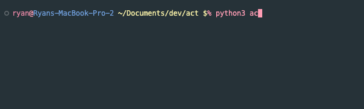

# `act`
Create custom ACTions for your terminal!

Tired of looking up a command for the 100th time on Stack Overflow?  Have useful invocations you want to find fast?

Try `act` today!

## Main features
* Create commands with freeform aliases & docstrings to remember what the heck they do.
* Fuzzy find in your commands' aliases, docstrings, and code
* Build new commands fast!  Use your existing aliases as a toolbox & dependency tree under the hood.
* Quick access to your most recently used commands.
* `act` is lightweight, built in Python, and stores your commands locally on your machine.  No unnecessasry clouds or accounts!